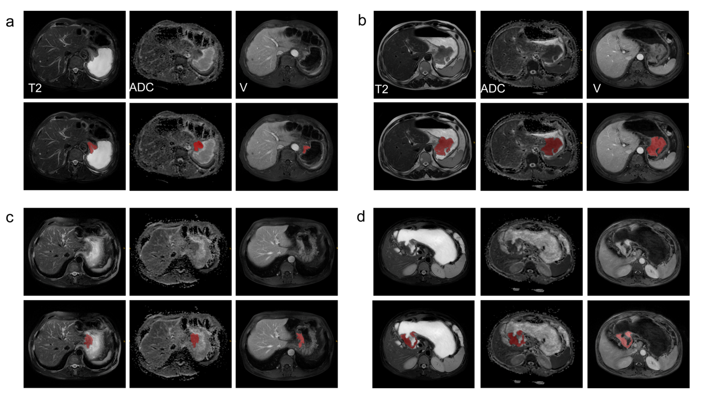

# HWA-UNETRv2

HWA-UNETRv2 is a three-stage framework for multimodal gastric MRI analysis,
iterated from
[HWA-UNETR](https://link.springer.com/chapter/10.1007/978-3-032-05141-7_27).
To the best of our knowledge, GCM 2026 is the first multi-task gastric MRI
dataset that supports lesion segmentation, lymph node metastasis
classification, and prognosis-related prediction. The full dataset will be
released after manuscript acceptance. Before the full release, representative
examples are available in `sample_data/gcm2026_examples/`.

## Installation

Run the following commands from the project root:

```bash
HWA_ENV_NAME="${HWA_ENV_NAME:-hwav2}"
source "$(conda info --base)/etc/profile.d/conda.sh"
conda env list | awk '{print $1}' | grep -qx "${HWA_ENV_NAME}" || conda create -n "${HWA_ENV_NAME}" python=3.11 -y
conda activate "${HWA_ENV_NAME}"
bash scripts/install_patched_mamba.sh
```

## Data

### GCM 2026 Dataset

GCM 2026, short for Gastric Cancer MRI Dataset 2026, is a multimodal gastric
cancer MRI dataset for model development and evaluation. This repository uses
GCM 2026 for three tasks:

- primary gastric tumor segmentation
- lymph node metastasis classification
- progression-free survival (PFS)-related prediction

The dataset contains 689 patients from Meizhou People's Hospital, collected
between August 2016 and March 2025. In addition to MRI volumes and tumor masks,
GCM 2026 provides lymph node metastasis (LN) labels and PFS-related labels for
patient-level prediction. Gastric lesion masks were manually delineated in 3D
with ITK-SNAP by experienced radiologists and reviewed by a senior radiologist.

Each case is expected to provide three MRI modalities:

- `ADC`: apparent diffusion coefficient map
- `T2_FS`: T2-weighted fat-saturated sequence
- `V`: contrast-enhanced venous-phase T1-weighted sequence



The figure presents representative GCM 2026 multimodal MRI cases, showing ADC,
T2_FS, and venous-phase images alongside manually annotated gastric lesion
masks.

The expected dataset layout is:

```text
/path/to/GCM_dataset/
  Classification.xlsx
  ALL/
    case_id/
      ADC/
        case_id.nii.gz
        case_idseg.nii.gz
      T2_FS/
        case_id.nii.gz
        case_idseg.nii.gz
      V/
        case_id.nii.gz
        case_idseg.nii.gz
```

Split files should contain one case identifier per line. The default split
configuration uses:

- `splits/train_examples.txt`: 481 cases
- `splits/val_examples.txt`: 69 cases
- `splits/test_examples.txt`: 137 cases

Five representative de-identified examples are provided under
`sample_data/gcm2026_examples/`. Each example contains ADC, T2_FS, and
venous-phase MRI volumes with gastric lesion masks. The accompanying
`sample_classification_metrics.xlsx` file records the corresponding
de-identified classification and prognosis labels.

### Configuration

Set the dataset paths in `config.yml` or in the stage-specific files under
`configs/`:

- `GCM_loader.root`: dataset root
- `GCM_loader.train_examples_path`: train split file
- `GCM_loader.val_examples_path`: validation split file
- `GCM_loader.test_examples_path`: test split file

The default modality setting is:

```yaml
GCM_loader:
  checkModels:
    - ADC
    - T2_FS
    - V
```

Update `GCM_loader.root` before training or evaluation. The repository includes
only the five de-identified sample cases described above and does not include
the full private cohort or patient identifiers.

## Training

See `TRAINING.md` for the full training guide.

```bash
# Default wrapper
bash run.sh stage2

# Stage 1: center anchoring detector
bash scripts/train_stage1.sh configs/stage1_detector.yaml

# Stage 2: HWA-guided segmentation
bash scripts/train_stage2.sh configs/stage2_segmentation.yaml

# Stage 3: prognostic prediction
bash scripts/train_stage3.sh configs/stage3_classification.yaml
```

For multi-GPU training, set `NPROC_PER_NODE`:

```bash
NPROC_PER_NODE=2 bash scripts/train_stage2.sh configs/stage2_segmentation.yaml
```

## Evaluation

```bash
bash scripts/eval_stage2.sh
bash scripts/eval_stage3.sh
```

Checkpoint paths can be overridden with `HWA_STAGE2_EVAL_CKPT` and
`HWA_STAGE3_EVAL_CKPT`.

## Project Layout

```text
configs/                 Stage-wise config templates
scripts/                 Stage-wise launch scripts
src/                     Model, loader, optimizer, and utilities
train.py                 Recommended unified training entry
GCM_train_core.py        Shared training implementation
GCM_train_stage*.py      Stage-specific launch wrappers
eval_stage2_*.py         Segmentation evaluation utilities
eval_stage3_*.py         Classification evaluation utilities
```
